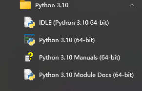

----------------
构建Python基本环境
----------------

---------------
下载Python开发包
---------------
### 1. 下载
   
官方网站：http://python.org

选择版本

Windows： 
(1) embeded version 绿色版本，仅包含解释器和少量工具 
(2) source pakcage 源码包，下载后解压编译 
(3) install pakcage 运行安装包，下载后运行或直接运行

### 2.安装

(1) 运行安装包；

(2) 选择安装选项；

### 3. 运行
(1) 方式1 
\> python 
Python 3.10.5 (tags/v3.10.5:f377153, Jun  6 2022, 16:14:13) [MSC v.1929 64 bit (AMD64)] on win32
Type "help", "copyright", "credits" or "license" for more information. 
\>>>

(2) 方式2 
\> py 
Python 3.10.5 (tags/v3.10.5:f377153, Jun  6 2022, 16:14:13) [MSC v.1929 64 bit (AMD64)] on win32
Type "help", "copyright", "credits" or "license" for more information. 
\>>>

(3) 方式3 
Windows Menu: 

---------------------
使用pip下载安装第三方包
---------------------

### 使用pip更新扩展包 pip update to specific version
pip install -U package==x.x.x 
pip install --upgrade psycopg2==2.7.5

### 国内常用的镜像网站 pip from tsinghua, aliyun
pip install [package] -i https://pypi.tuna.tsinghua.edu.cn/simple
pip install [package] -i http://mirrors.aliyun.com/pypi/simple/ --trusted-host mirrors.aliyun.com

### 设置缺省的下载源 set default source
pip config set global.index-url https://pypi.tuna.tsinghua.edu.cn/simple

### 设置pip配置文件 set pip.ini
[global]  
timeout=40  
index-url=https://pypi.tuna.tsinghua.edu.cn/simple  
extra-index-url= 
&ensp; &ensp; &ensp; https://mirrors.aliyun.com/pypi/simple  
&ensp; &ensp; &ensp; https://pypi.douban.com/simple  
&ensp; &ensp; &ensp; https://pypi.mirrors.ustc.edu.cn/simple  

[install] 
trusted-host= 
&ensp; &ensp; &ensp; https://pypi.tuna.tsinghua.edu.cn  
&ensp; &ensp; &ensp; https://mirrors.aliyun.com  
&ensp; &ensp; &ensp; https://pypi.douban.com  
&ensp; &ensp; &ensp; https://pypi.mirrors.ustc.edu.cn  
